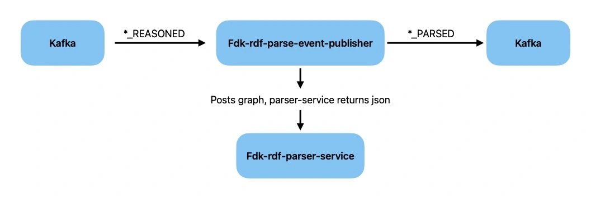

RDF parsing consists of three components:

1. **RDF Parser** \
Parser Library written in Python \
Repository: [fdk-rdf-parser](https://github.com/Informasjonsforvaltning/fdk-rdf-parser)

2. **RDF Parser Service** \
JSON API service responsible for parsing RDF (turtle) to JSON using RDF Parser. \
Repository: [fdk-rdf-parser-service](https://github.com/Informasjonsforvaltning/fdk-rdf-parser-service)

3. **RDF Parse Event Publisher** \
Kafka consumer/producer consuming events of type reasoned and producing RDF Parse Events using RDF Parser Service. \
Repository: [fdk-rdf-parse-event-publisher](https://github.com/Informasjonsforvaltning/fdk-rdf-parse-event-publisher)

