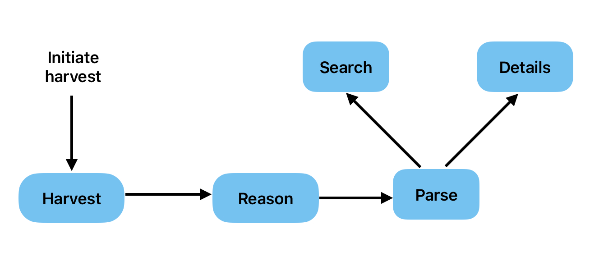
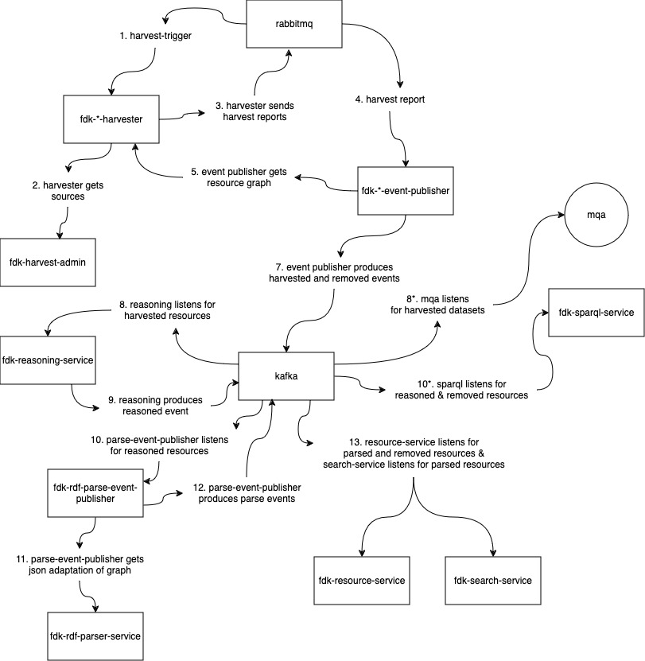

The harvest solution consists of 3 parts:
* [Harvest](https://informasjonsforvaltning.github.io/data.norge.no/harvesting/harvesters) - The resources are downloaded from several sources, split into single resource-graphs and given an id
* [Reason](https://github.com/Informasjonsforvaltning/fdk-reasoning-service) - Each resource graph is enriched with relevant data
* [Parse](https://informasjonsforvaltning.github.io/data.norge.no/harvesting/rdf-parse) - Each resource graph is converted to JSON

The finished JSON-representation of each resource is then picked up by both the backend for the search page, [fdk-search-service](https://github.com/Informasjonsforvaltning/fdk-search-service), and the backend for the details page, [fdk-resource-service](https://github.com/Informasjonsforvaltning/fdk-resource-service). Changes in the resources are available in [data.norge](https://data.norge.no) when these two services have been updated.

The harvest process can be initiated by two services:
* [Harvest scheduler](https://github.com/Informasjonsforvaltning/fdk-harvest-scheduler) - Initiates harvest of all sources from predefined schedules.
* [Harvest admin](https://informasjonsforvaltning.github.io/data.norge.no/harvesting/harvest-admin) - This is where sources are registered for harvest, each source has a button to initiate harvest of that specific source.

The communication between the relevant services is handled by a combination of [RabbitMQ](https://www.rabbitmq.com) and [Apache Kafka](https://kafka.apache.org). The harvests are triggered by messages published in RabbitMQ, and the harvesters will publish harvest reports for each source in RabbitMQ when they are done. These reports contain information about each resource with changes and each resource that has been removed from the source since the last harvest.
These reports are picked up by different versions of [fdk-kafka-event-publisher](https://github.com/Informasjonsforvaltning/fdk-kafka-event-publisher), and will produce events in Kafka for each changed resource.
[Reasoning](https://github.com/Informasjonsforvaltning/fdk-reasoning-service) consumes events about changed resources and produces new events with the enriched graphs. [Parsing]() consumes events about reasoned resources and produces new events with a JSON version of the resource. The events about parsed resources are consumed by [fdk-search-service](https://github.com/Informasjonsforvaltning/fdk-search-service) and [fdk-resource-service](https://github.com/Informasjonsforvaltning/fdk-resource-service) and the harvest process is finished.

Parts of FDK not strictly part of the harvest process that are also dependent of the kafka events produced by the process:
* [fdk-sparql-service](https://github.com/Informasjonsforvaltning/fdk-sparql-service) That listens for reasoned and removed messages to maintain updated graphs available for sparql queries
* [MQA](https://informasjonsforvaltning.github.io/data.norge.no/metadata-quality) That listens for `DATASET_HARVESTED` to produce an assessment of the harvested datasets

## Detailed schema of the harvest process

