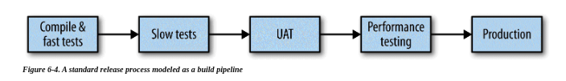

On testing microservices and how we do it.

From Clemson "Testing Strategies in a Microservice Architecture" we have borrowed the following strategies:

- unit
- integration
- component
- contract
- end-to-end

As an alternative to end-to-end tests we prefer a technique called _semantic monitoring_, where we use fake events (_synthetic transactions_) to ensure that the system is behaving semantically.

Another aspect of testing is _timing_, when to run what tests [1]:

----------------------------------------
### References
- [1]: <https://martinfowler.com/articles/microservice-testing/>
- [2]: <https://samnewman.io/books/building_microservices/>
