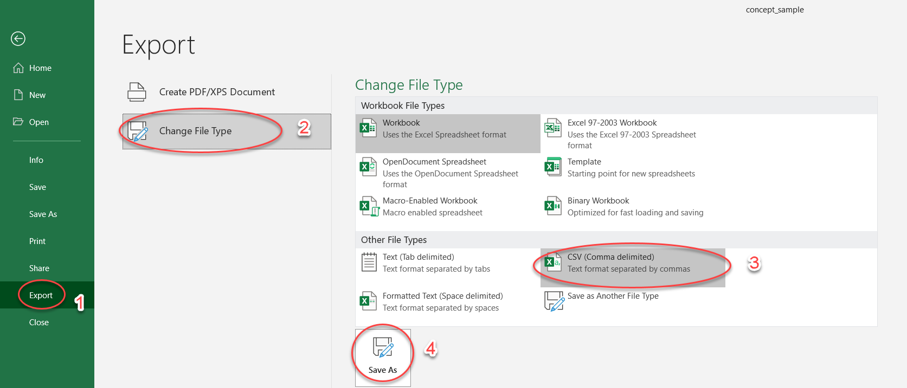
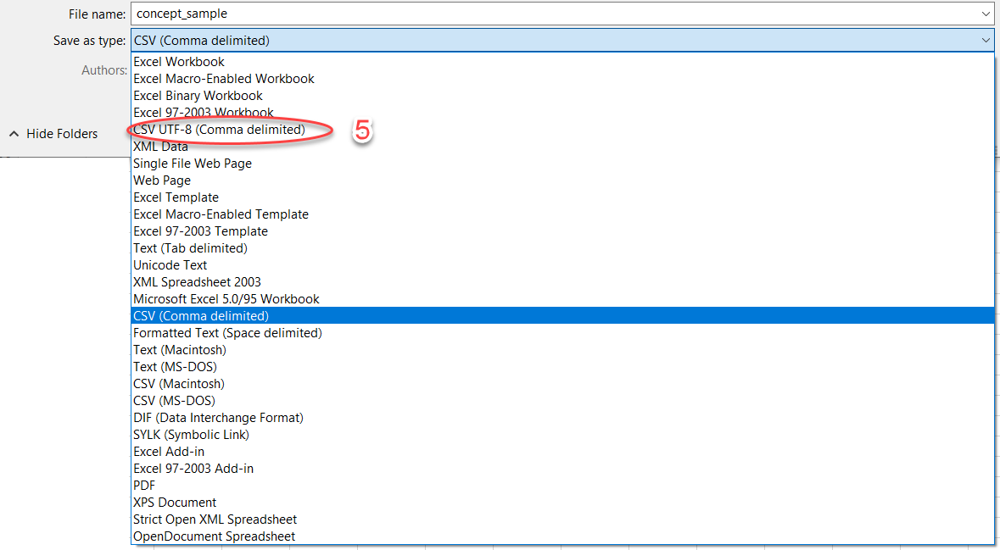

Her følger en kort beskrivelse av hvordan man kan publisere begreper i Felles datakatalog.

## Registrere begreper i Begrepskatalog GUI

I [registreringsløsningen](https://registrering.fellesdatakatalog.digdir.no) vår kan du registrere begreper og velge å publisere de slik at informasjonen blir tilgjengelig i portalløsningen av Felles datakatalog <https://data.norge.no>.

### Importere Begreper

Virksomheter som har utarbeidet en strukturert oversikt over noen av sine begreper, for eksempel i et regneark eller tabell, kan overføre disse til registreringsløsningen i Felles datakatalog gjennom import av en CSV- eller JSON fil.

#### Hvordan Importere begreper fra CSV format?

For at importen til registreringsløsningen skal fungere må begrepene og beskrivelsene følge en struktur som er nærmere beskrevet i denne [malen](https://github.com/Informasjonsforvaltning/fdk-testdata/raw/master/testdata/concept_sample.xlsx).

Noen av kolonnene, for eksempel _tillatt_term_ har støtte for flere verdier. For å legge inn flere forekomster legger du til en ekstra kolonne med samme navn på første linje (overskrift) eller separerer forekomstene med |.

Enkelte felter har også støtte for flere språk og målformer. Den nåværende importløsningen støtter norsk bokmål (nb), nynorsk (nn) og engelsk (en). Hvis språk og målform ikke er oppgitt vil denne automatisk bli satt til bokmål under importen.

Legg til eller kopier inn termer og tilhørende informasjon ved å sette inn flere rader inntil listen du ønsker å importere til registreringsløsningen er komplett.

#### Eksempel

I tabellen nedenfor er kolonne a og b formattert for norsk bokmål, og kolonne c og d for engelsk.

| anbefalt_term:nb | tillatt_term:nb | anbefalt_term:en | tillatt_term:en | frarådet_term:nb | definisjon:nb
| --- | --- | --- | --- | --- | --- |
| test eksempel | eksempeltest | test example | example test | illustrasjonstest | Dette er en definisjon på et eksempel |

Kolonner som ikke gjenkjennes under importen vil bli ignorert, så test gjerne med et par begreper først og kontroller at disse blir korrekt importert i registreringsløsningen. Selve rekkefølgen på kolonnene har ikke noe å si for importen av begreper.

#### Om innholdet i feltene

| Felt | Kommentar | Eksempel |
| --- | --- | --- |
| anbefalt_term | Flere språk og målformer, kun en kolonne pr språk og målform. | |
| tillatt_term | Flere språk og målformer, ubegrenset antall kolonner pr målform (kan ha flere tillatte termer). Kan også legge til flere termer i samme kolonne ved å separere termene med \| | tillattTerm1\|tillattTerm2\|tillattTerm3 |
| frarådet_term | Flere språk og målformer, ubegrenset antall kolonner pr målform (kan ha flere frarådede termer). Kan også legge til flere termer i samme kolonne ved å separere termene med \| | frarådetTerm1\|frarådetTerm2\|frarådetTerm3 |
| definisjon | Flere språk og målformer, kun en kolonne pr språk og målform. | |
| definisjon:forhold_til_kilde | må være en av: «egendefinert», «basertPaaKilde» eller «sitatFraKilde» | |
| definisjon:kilde | Formateres med tekstbeskrivelse og gyldig uri til kilde separert med tegnet \|. Ikke mulig å oppgi kilde hvis "forhold_til_kilde" er "egendefinert". | «Digitaliseringsdirektoratet\|<https://www.digdir.no/>» |
| definisjon_for_allmennheten | Flere språk og målformer, kun en kolonne pr språk og målform. | |
| definisjon_for_allmennheten:forhold_til_kilde | må være en av: «egendefinert», «basertPaaKilde» eller «sitatFraKilde» | |
| definisjon_for_allmennheten:kilde | Formateres med tekstbeskrivelse og gyldig uri til kilde separert med tegnet \|. Ikke mulig å oppgi kilde hvis "forhold_til_kilde" er "egendefinert". | |
| definisjon_for_spesialister | Flere språk og målformer, kun en kolonne pr språk og målform. | |
| definisjon_for_spesialister:forhold_til_kilde | må være en av: «egendefinert», «basertPaaKilde» eller «sitatFraKilde» | |
| definisjon_for_spesialister:kilde | Formateres med tekstbeskrivelse og gyldig uri til kilde separert med tegnet \|. Ikke mulig å oppgi kilde hvis "forhold_til_kilde" er "egendefinert". | |
| merknad | Flere språk og målformer, kun en kolonne pr språk og målform. | |
| eksempel | Flere språk og målformer, kun en kolonne pr språk og målform. | |
| fagområde | Flere språk og målformer, kun en kolonne pr språk og målform. | terminologi |
| verdiområde:uri | Kun en kolonne med gyldig uri. | https://www.ssb.no/klass/klassifikasjoner/19 |
| verdiområde:tekst | Kun en kolonne med tekstbeskrivelse. | Standard for sivilstand |
| kontaktpunkt:epost | Kun en kolonne. Rader må inneholde gyldig epostadresse. | |
| kontaktpunkt:telefon | Kun en kolonne. | |
| gyldig_fom | Fra og med dato for perioden hvor begrepet er gyldig. Kun en kolonne. Dato formattert med (åååå-mm-dd) år, måned, dag. | 2020-01-31 |
| gyldig_tom | Til og med dato for perioden hvor begrepet er gyldig. Kun en kolonne. Dato formattert med (åååå-mm-dd) år, måned, dag. | 2020-12-01 |
| se_også | NB! Dette feltet kan ikke brukes til eksterne referanser utenfor begrepskatalogen. Det anbefales sterkt å sette dette etter begrepet er registrert inn. Kun en kolonne støttes og rader må inneholde en gyldig uri som peker til eksisterende begrep i begrepskatalogen. | |
| versjon | Versjonsnummer til begrepet. Består av tre siffer der første siffer er «major», andre siffer er «minor» og tredje er «patch». For at begrepet skal importeres må versjonsnummeret minimum være «minor», dvs. 0.1.0. | 0.1.0 |

Du kan lese mer om beskrivelser av begrep her: [Forvaltningsstandard for begrepsbeskrivelser (SKOS-AP-NO-Begrep)](https://data.norge.no/specification/skos-ap-no-begrep/)

#### Lagring

Når du har fylt tabellen med innhold i henhold til malen (riktig formattering) må du huske å eksportere den som en CSV-fil med semikolon separering og UTF-8 koding.

Eksempel med utgangspunkt i Excel for Microsoft 365:

* 1 - Trykk på 'Export'
* 2 - Trykk på 'Change File Type'
* 3 - Velg 'CSV (comma delimited)'
* 4 - Trykk på 'Save as'
* 5 - Velg 'CSV UTF-8 (comma delimited)' under 'Save as type'




Du er nå klar for å importere CSV filen i registreringsløsningen.

Logg deg inn på [Registreringsløsningen](https://registrering.fellesdatakatalog.digdir.no) og velg Begrepskatalogen. Vær oppmerksom på at du må ha rettigheten «Felles datakatalog - alle kataloger - virksomhetsadministrator i Altinn for å kunne importere.

Klikk på «Importer begreper» og velg den csv- eller json-filen du har opprettet.

#### Eksempel på CSV-fil

```Shell
anbefalt_term:nb;tillatt_term:nb;anbefalt_term:en;tillatt_term:en;frarådet_term:nb;definisjon:nb
test eksempel;eksempeltest;Test example;example test;illustrasjonstest;Dette er en definisjon på et eksempel
```

#### Hvordan Importere begreper fra JSON format?

Opprett en JSON fil med 1 eller flere begreper på formatet under:

```JSON
[
  {
    "anbefaltTerm": {
      "navn": {
        "nb": "anbefalt term på norsk bokmål",
        "nn": "tilrådd term på norsk nynorsk",
        "en":"recommended term in english"
              }
    },
    "tillattTerm": {
      "nb": [
          "tillatt term 1 på norsk bokmål",
          "tillatt term 2 på norsk bokmål"
      ],
      "nn": [
          "tillaten term 1 på norsk nynorsk",
          "tillaten term 2 på norsk nynorsk"
      ],
      "en": [
          "alternative term 1 in english",
          "alternative term 2 in english"
      ]
    },
    "frarådetTerm": {
      "nb": [
          "frarådet term 1 på norsk bokmål",
          "frarådet term 2 på norsk bokmål"
      ],
      "nn": [
          "frårådd term 1 på norsk nynorsk",
          "frårådd term 2 på norsk nynorsk"
      ],
      "en": [
          "hidden term 1 in english",
          "hidden term 2 in english"
     ]
    },
    "definisjon": {
      "tekst": {
          "nb": "definisjon på norsk bokmål",
          "nn": "definisjon på norsk nynorsk",
          "en": "definition in english"
      }
    },
    "kildebeskrivelse": {
      "forholdTilKilde": "egendefinert",
      "kilde": [] 
    },
    "definisjonForAllmennheten": {
        "tekst": {
            "nb": "definisjon for allmennheten på norsk bokmål",
            "nn": "definisjon for allmenta på norsk nynorsk",
            "en": "definition for public in english"
        },
        "kildebeskrivelse": {
            "forholdTilKilde": "sitatFraKilde",
            "kilde": [
                {
                    "tekst": "Tittel på kilde_allmennheten",
                    "uri": "http://kildesitatallmennhetenuri.no/"
                }
            ]
        }
    },
    "definisjonForSpesialister": {
        "tekst": {
            "nb": "definisjon for spesialist på norsk bokmål",
            "nn": "definisjon for spesialist på norsk nynorsk",
            "en": "definition for specialist in english"
        },
        "kildebeskrivelse": {
            "forholdTilKilde": "basertPaaKilde",
            "kilde": [
                {
                    "tekst": "Tittel på kilde_spesialister",
                    "uri": "http://kildebasertspesialisteruri.no/"
                }
            ]
        }
    },
    "merkelapp": [
        "test-import-json"
    ],
    "gyldigFom": "2023-11-20",
    "gyldigTom": "2024-11-25",
    "seOgså": [
        "http://begrepskatalogen/begrep/20b2e299-9fe1-11e5-a9f8-e4115b280940",
        "http://begrepskatalogen/begrep/20b2e299-9fe1-11e5-a9f8-e4115b280940"
    ],
    "erstattesAv": [
        "http://begrepskatalogen/begrep/20b2e284-9fe1-11e5-a9f8-e4115b280940"
    ],
    "abbreviatedLabel": "forkortelse-av-begrepet",
    "begrepsRelasjon": [
        {
            "relasjon": "assosiativ",
		    "beskrivelse": {
                "nb": "beskrivelse på norsk bokmål",
                "nn": "skildring på norsk nynorsk",
                "en": "description in english"
            },
            "relatertBegrep": "http://begrepskatalogen/begrep/20b2e277-9fe1-11e5-a9f8-e4115b280940"
        },
	{
            "relasjon": "partitiv",
			"relasjonsType": "omfatter",
            "inndelingskriterium": {
                "nb": "inndelingskriterium på norsk bokmål",
                "nn": "inndelingskriterium på norsk nynorsk",
                "en": "division criterion in english"
            },
            "relatertBegrep": "http://begrepskatalogen/begrep/20b2e277-9fe1-11e5-a9f8-e4115b280940"
        },
	{
            "relasjon": "partitiv",
			"relasjonsType": "erDelAv",
            "inndelingskriterium": {
                "nb": "inndelingskriterium på norsk bokmål",
                "nn": "inndelingskriterium på norsk nynorsk",
                "en": "division criterion in english"
            },
            "relatertBegrep": "http://begrepskatalogen/begrep/20b2e277-9fe1-11e5-a9f8-e4115b280940"
        },
	{
            "relasjon": "generisk",
			"relasjonsType": "overordnet",
            "inndelingskriterium": {
                "nb": "inndelingskriterium på norsk bokmål",
                "nn": "inndelingskriterium på norsk nynorsk",
                "en": "division criterion in english"
            },
            "relatertBegrep": "http://begrepskatalogen/begrep/20b2e277-9fe1-11e5-a9f8-e4115b280940"
        },
	{
            "relasjon": "generisk",
			"relasjonsType": "underordnet",
            "inndelingskriterium": {
                "nb": "inndelingskriterium på norsk bokmål",
                "nn": "inndelingskriterium på norsk nynorsk",
                "en": "division criterion in english"
            },
            "relatertBegrep": "http://begrepskatalogen/begrep/20b2e277-9fe1-11e5-a9f8-e4115b280940"
        }
    ],
    "merknad": {
        "nb": "Tilleggsopplysninger om begrepets betydning som ikke hører hjemme i definisjonsfeltet på norsk bokmål",
        "nn": "Tilleggsopplysningar om betydninga av omgrepet som ikkje høyrer heime i definisjonsfeltet på nynorsk",
        "en": "Additional information about the term's meaning that does not belong in the definition field in english "
    },
    "eksempel": {
        "nb": "Eksempler på konkrete tilfeller av begrepet på norsk bokmål",
        "nn": "Døme på konkrete tilfelle av omgrepet på norsk nynorsk",
        "en": "Examples of concrete cases of the concept in english"
    },
    "fagområdeKoder": [
	"4"
    ],
    "fagområde": {
        "nb": [
            "Spesialisert kunnskapsområde som begrepet tilhører på norsk bokmål"
        ],
        "nn": [
            "Spesialisert kunnskapsområde som omgrepet tilhøyrer på norsk nynorsk"
        ],
        "en": [
            "Specialized knowledge area to which the concept belongs in english"
        ]
    },
    "omfang": {
        "tekst": "Tittel på verdiområde",
        "uri": "http://lenketilverdiomraade.no"
    },
    "kontaktpunkt": {
        "harEpost": "e-post@epost.no",
        "harTelefon": "12345678"
    },
    "statusURI": "http://publications.europa.eu/resource/authority/concept-status/DRAFT",
    "versjonsnr": {
        "major": "0",
        "minor": "1",
        "patch": "0"
    }
  },
  {
    "anbefaltTerm": {
      "navn": {
        "nb": "anbefalt term 2 på norsk bokmål",
        "nn": "tilrådd term 2 på norsk nynorsk",
        "en":"recommended term 2 in english"
              }
    },
    "tillattTerm": {
      "nb": [
          "tillatt term 1 på norsk bokmål",
          "tillatt term 2 på norsk bokmål"
      ],
      "nn": [
          "tillaten term 1 på norsk nynorsk",
          "tillaten term 2 på norsk nynorsk"
      ],
      "en": [
          "alternative term 1 in english",
          "alternative term 2 in english"
      ]
    },
    "frarådetTerm": {
      "nb": [
          "frarådet term 1 på norsk bokmål",
          "frarådet term 2 på norsk bokmål"
      ],
      "nn": [
          "frårådd term 1 på norsk nynorsk",
          "frårådd term 2 på norsk nynorsk"
      ],
      "en": [
          "hidden term 1 in english",
          "hidden term 2 in english"
     ]
    },
    "definisjon": {
      "tekst": {
          "nb": "definisjon på norsk bokmål",
          "nn": "definisjon på norsk nynorsk",
          "en": "definition in english"
      }
    },
    "kildebeskrivelse": {
      "forholdTilKilde": "egendefinert",
      "kilde": [] 
    },
    "definisjonForAllmennheten": {
        "tekst": {
            "nb": "definisjon for allmennheten på norsk bokmål",
            "nn": "definisjon for allmenta på norsk nynorsk",
            "en": "definition for public in english"
        },
        "kildebeskrivelse": {
            "forholdTilKilde": "sitatFraKilde",
            "kilde": [
                {
                    "tekst": "Tittel på kilde_allmennheten",
                    "uri": "http://kildesitatallmennhetenuri.no/"
                }
            ]
        }
    },
    "definisjonForSpesialister": {
        "tekst": {
            "nb": "definisjon for spesialist på norsk bokmål",
            "nn": "definisjon for spesialist på norsk nynorsk",
            "en": "definition for specialist in english"
        },
        "kildebeskrivelse": {
            "forholdTilKilde": "basertPaaKilde",
            "kilde": [
                {
                    "tekst": "Tittel på kilde_spesialister",
                    "uri": "http://kildebasertspesialisteruri.no/"
                }
            ]
        }
    },
    "merkelapp": [
        "test-import-json"
    ],
    "gyldigFom": "2023-11-20",
    "gyldigTom": "2024-11-25",
    "seOgså": [
        "http://begrepskatalogen/begrep/20b2e299-9fe1-11e5-a9f8-e4115b280940",
        "http://begrepskatalogen/begrep/20b2e299-9fe1-11e5-a9f8-e4115b280940"
    ],
    "erstattesAv": [
        "http://begrepskatalogen/begrep/20b2e284-9fe1-11e5-a9f8-e4115b280940"
    ],
    "abbreviatedLabel": "forkortelse-av-begrepet",
    "begrepsRelasjon": [
        {
            "relasjon": "assosiativ",
		    "beskrivelse": {
                "nb": "beskrivelse på norsk bokmål",
                "nn": "skildring på norsk nynorsk",
                "en": "description in english"
            },
            "relatertBegrep": "http://begrepskatalogen/begrep/20b2e277-9fe1-11e5-a9f8-e4115b280940"
        },
	{
            "relasjon": "partitiv",
			"relasjonsType": "omfatter",
            "inndelingskriterium": {
                "nb": "inndelingskriterium på norsk bokmål",
                "nn": "inndelingskriterium på norsk nynorsk",
                "en": "division criterion in english"
            },
            "relatertBegrep": "http://begrepskatalogen/begrep/20b2e277-9fe1-11e5-a9f8-e4115b280940"
        },
	{
            "relasjon": "partitiv",
			"relasjonsType": "erDelAv",
            "inndelingskriterium": {
                "nb": "inndelingskriterium på norsk bokmål",
                "nn": "inndelingskriterium på norsk nynorsk",
                "en": "division criterion in english"
            },
            "relatertBegrep": "http://begrepskatalogen/begrep/20b2e277-9fe1-11e5-a9f8-e4115b280940"
        },
	{
            "relasjon": "generisk",
			"relasjonsType": "overordnet",
            "inndelingskriterium": {
                "nb": "inndelingskriterium på norsk bokmål",
                "nn": "inndelingskriterium på norsk nynorsk",
                "en": "division criterion in english"
            },
            "relatertBegrep": "http://begrepskatalogen/begrep/20b2e277-9fe1-11e5-a9f8-e4115b280940"
        },
	{
            "relasjon": "generisk",
			"relasjonsType": "underordnet",
            "inndelingskriterium": {
                "nb": "inndelingskriterium på norsk bokmål",
                "nn": "inndelingskriterium på norsk nynorsk",
                "en": "division criterion in english"
            },
            "relatertBegrep": "http://begrepskatalogen/begrep/20b2e277-9fe1-11e5-a9f8-e4115b280940"
        }
    ],
    "merknad": {
        "nb": "Tilleggsopplysninger om begrepets betydning som ikke hører hjemme i definisjonsfeltet på norsk bokmål",
        "nn": "Tilleggsopplysningar om betydninga av omgrepet som ikkje høyrer heime i definisjonsfeltet på nynorsk",
        "en": "Additional information about the term's meaning that does not belong in the definition field in english "
    },
    "eksempel": {
        "nb": "Eksempler på konkrete tilfeller av begrepet på norsk bokmål",
        "nn": "Døme på konkrete tilfelle av omgrepet på norsk nynorsk",
        "en": "Examples of concrete cases of the concept in english"
    },
    "fagområdeKoder": [
	"5"
    ],
    "fagområde": {
        "nb": [
            "Spesialisert kunnskapsområde som begrepet tilhører på norsk bokmål"
        ],
        "nn": [
            "Spesialisert kunnskapsområde som omgrepet tilhøyrer på norsk nynorsk"
        ],
        "en": [
            "Specialized knowledge area to which the concept belongs in english"
        ]
    },
    "omfang": {
        "tekst": "Tittel på verdiområde",
        "uri": "http://lenketilverdiomraade.no"
    },
    "kontaktpunkt": {
        "harEpost": "e-post@epost.no",
        "harTelefon": "12345678"
    },
    "statusURI": "http://publications.europa.eu/resource/authority/concept-status/DRAFT",
    "versjonsnr": {
        "major": "0",
        "minor": "1",
        "patch": "0"
    }
  }
]
```
