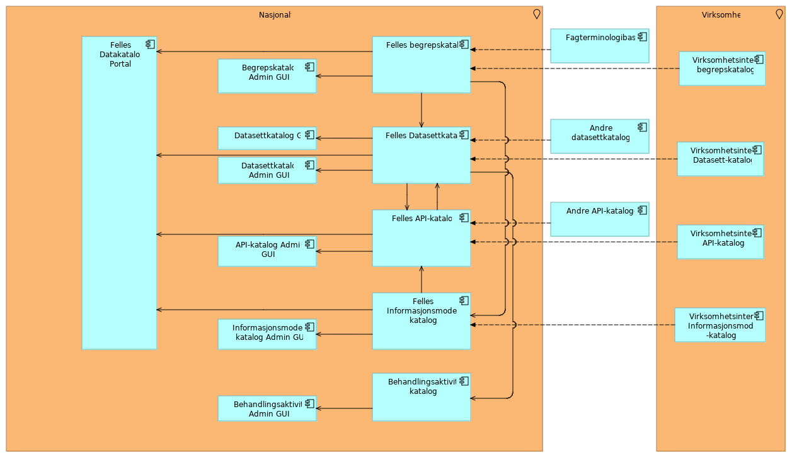

Vi jobber kontinuerlig med å oppdatere målbildet vårt etter hvert som behovene endrer seg. I hovedsak dreier endringene seg om å implementere støtte for nye typer kataloger.
## Om komponentene i målbildet
* Felles Datakatalog Portal: grafisk brukergrensesnitt der publikum har generell tilgang til oversikt over innhold som er publisert av hver enkelt virksomhet.
* Felles \<katalog\>: samling av kataloger som virksomheter har publisert. Disse komponentene tilbyr et maskin-til-maskin grensesnitt (API) mot de ulike katalogene.
* \<Katalog\> GUI: Et brukergrensesnitt der virksomheten har tilgang til søk og oppslag i sin katalog.
* \<Katalog\> Admin GUI: En administrativt løsning der virksomheten administrerer sin katalog og høsteløsning fra eventuell virksomhetsintern informasjonsmodell-katalog.
* Virksomhetsintern \<katalog\>: lokale kataloger som er installert hos den enkelte virksomhet og vedlikeholdes og driftes av virksomheten. Understøtter høsting.

## Diagram
Sammenhengen illustreres i følgende diagram:

## Modellene

* Archi-modellen: https://github.com/Informasjonsforvaltning/SA_Informasjonsforvaltning
* Html-versjon: https://informasjonsforvaltning.github.io/SA_Informasjonsforvaltning/
