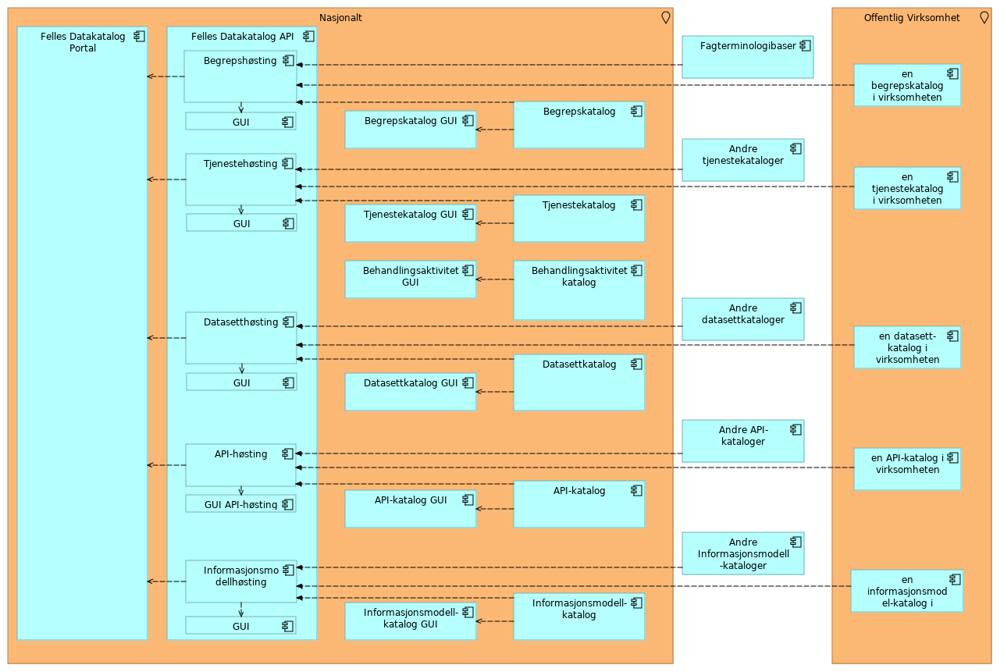

Vi jobber kontinuerlig med å oppdatere målbildet vårt etter hvert som behovene endrer seg. I hovedsak dreier endringene seg om å implementere støtte for nye typer kataloger.

# Diagram

Sammenhengen mellom komponenten illustreres i følgende diagram: 

# Om komponentene i målbildet

- Felles Datakatalog Portal: grafisk brukergrensesnitt der publikum har generell tilgang til oversikt over innhold som er publisert av hver enkelt virksomhet.
- Felles Datakatalog API: back-end komponenter som høster og lagrer fra ulike kilde-kataloger. Tilbyr API for å lese katalog-innhold.
- X-katalog: samling av kataloger som virksomheter har publisert. Disse komponentene tilbyr et maskin-til-maskin grensesnitt (API) mot de ulike katalogene. Understøtter høsting på standardiserte formater (feks DCAT-AP-NO, SKOS-AP-NO).
- X-katalog GUI: Et rollebasert brukergrensesnitt der virksomheten har tilgang til søk og oppslag i sin katalog.
- en x-katalog i virksomheten: lokale kataloger som er installert hos den enkelte virksomhet og vedlikeholdes og driftes av virksomheten. Understøtter høsting.

# Modellene

- Archi-modellen: <https://github.com/Informasjonsforvaltning/SA_Informasjonsforvaltning>
- Html-versjon: <https://informasjonsforvaltning.github.io/SA_Informasjonsforvaltning/>
