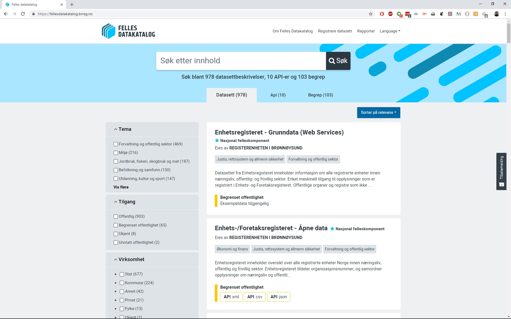

&nbsp;
 </img>

<small>DATASETT - BEGREPER - API - INFORMASJONSMODELLER - TJENESTER - HENDELSER</small>

**Felles datakatalog (FDK)** er en løsning som gir oversikt over datasett, begreper, API, informasjonsmodeller, tjenester og hendelser (og sammenhenger mellom disse) i offentlig sektor.

I menyen til venstre kan du finne informasjon om de ulike katalogene.

### Hvor finner jeg felles datakatalog?

Her finner du Felles datakatalog: <https://data.norge.no>

### Hvordan kan jeg teste felles datakatalog?

Her finner du vårt demo miljø: <https://demo.fellesdatakatalog.digdir.no>

Her finner du registreringsløsningene i demo miljøet: <https://registrering.demo.fellesdatakatalog.digdir.no>

For å få demo-bruker kan du ta kontakt på mail: <fellesdatakatalog@digdir.no>

### Har dere statistikk på bruk?

Ja, se her for [statistikk](statistikk) over innhold og bruk av felles datakatalog.

### Hva er planer for løsningen videre?

Ved å følge vår åpne behovsprosess vil du finne ut alt om våre neste leveranser. Se [Behovsprosessen](../behovsprosessen/).
